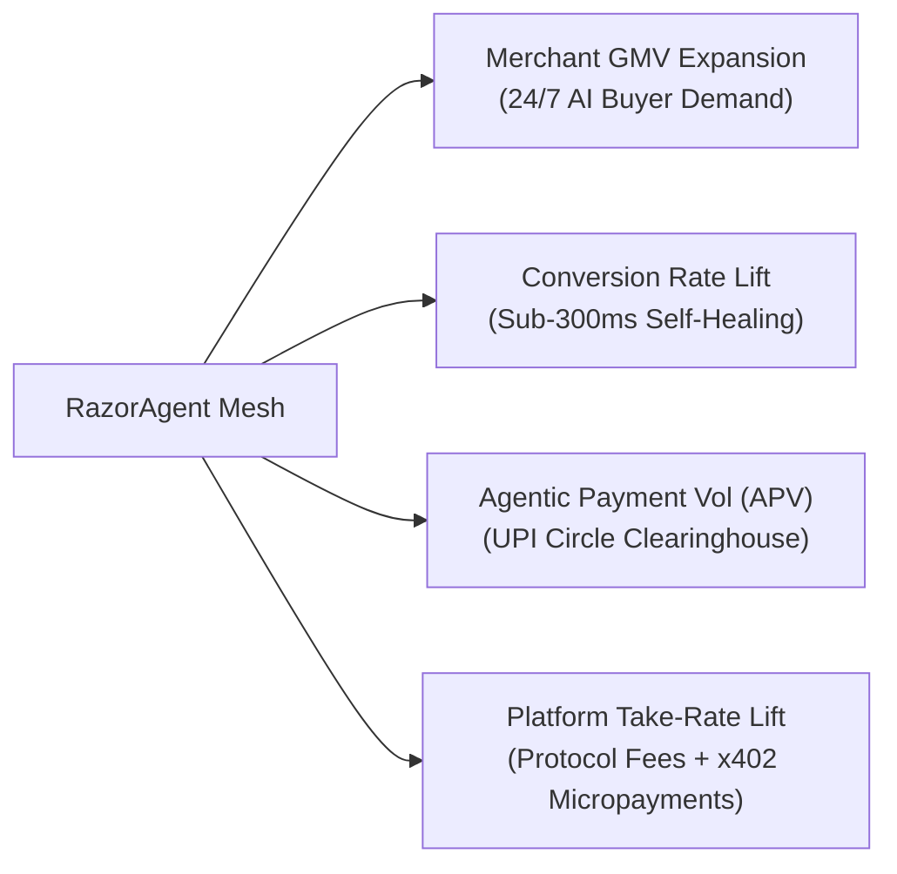
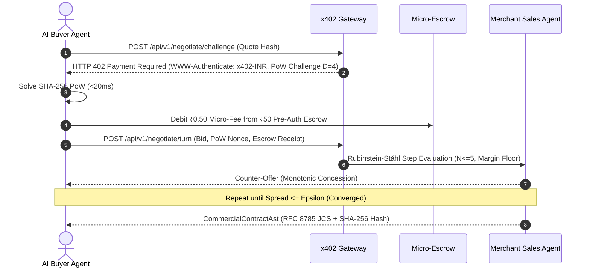
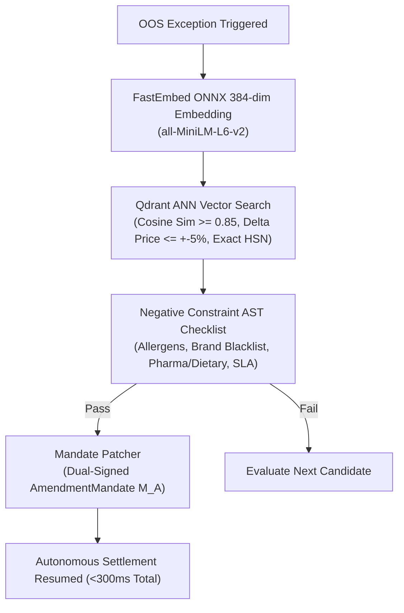
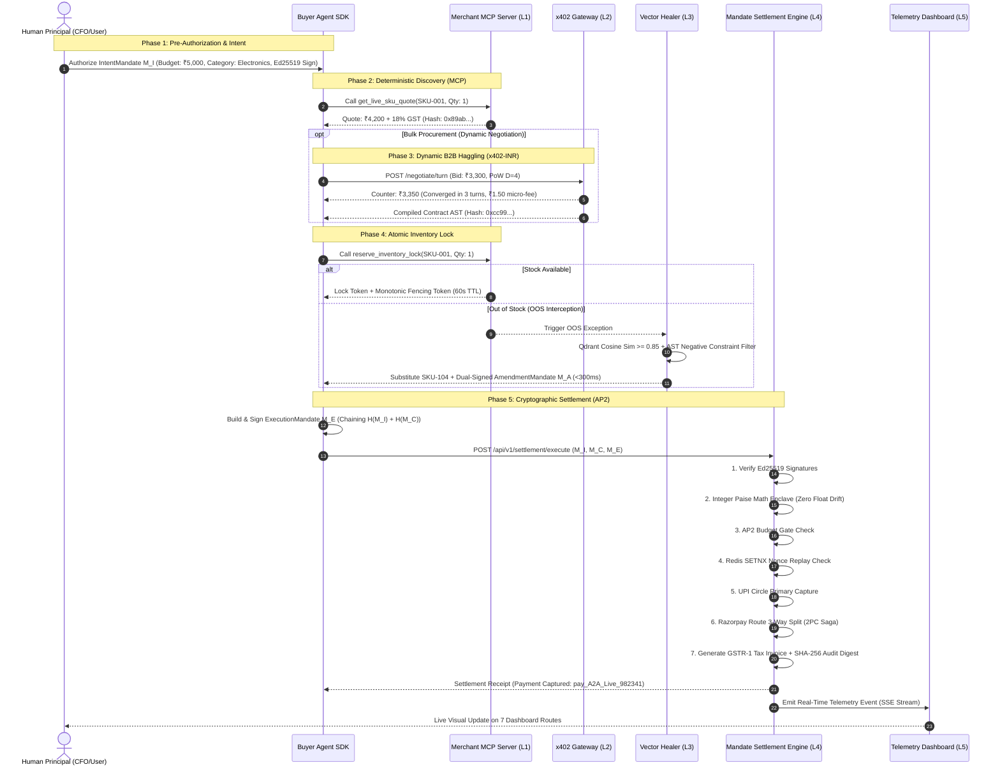

# 📖 RazorAgent Mesh v2.0 — Complete System Guide, Architecture & Presentation Blueprint

> **Project:** RazorAgent Mesh v2.0 ("Stripe for the Autonomous Agentic Economy")  
> **Hackathon Track:** Track 01 — AI Growth & Agentic Commerce (Razorpay AI Buildathon 2026)  
> **Author:** Shubham Verma  
> **Target Program:** Razorpay AI Builder Internship (Bangalore HQ)  
> **Status:** Production Hardened (Version 2.0) | 10 adversarial benchmark scenarios, 30 property-based invariants, and 12 cross-language GST vectors, all green  

---

## 📑 Table of Contents
1. [Executive Summary & Core Philosophy](#1-executive-summary--core-philosophy)
2. [Strategic Value for Razorpay (Track 01 Alignment)](#2-strategic-value-for-razorpay-track-01-alignment)
3. [Deep-Dive Protocol Architecture](#3-deep-dive-protocol-architecture)
   - [3.1 Layer 0: Ingress Security Shield & Ingestion Adapters](#31-layer-0-ingress-security-shield--ingestion-adapters)
   - [3.2 Layer 1: Deterministic Discovery (Anthropic MCP JSON-RPC 2.0)](#32-layer-1-deterministic-discovery-anthropic-mcp-json-rpc-20)
   - [3.3 Layer 2: B2B Dynamic Negotiation & Alerts (x402-INR)](#33-layer-2-b2b-dynamic-negotiation--alerts-x402-inr)
   - [3.4 Layer 3: Sub-300ms Vector Self-Healing Engine (Qdrant + AST)](#34-layer-3-sub-300ms-vector-self-healing-engine-qdrant--ast)
   - [3.5 Layer 4: AP2 Cryptographic Settlement & Tax Enclave](#35-layer-4-ap2-cryptographic-settlement--tax-enclave)
   - [3.6 Layer 5: Real-Time Observability & Telemetry](#36-layer-5-real-time-observability--telemetry)
4. [How All Protocols Combine: End-to-End Autonomous Transaction Lifecycle](#4-how-all-protocols-combine-end-to-end-autonomous-transaction-lifecycle)
5. [The 7 Core Mathematical & Cryptographic Invariants](#5-the-7-core-mathematical--cryptographic-invariants)
6. [Interactive Frontend Guide: Telemetry Dashboard & Merchant SKU Studio](#6-interactive-frontend-guide-telemetry-dashboard--merchant-sku-studio)
   - [6.1 Google Stitch Dual-Palette Design System & Theme Engine](#61-google-stitch-dual-palette-design-system--theme-engine)
   - [6.2 Deep Dive into the 7 Dashboard Routes](#62-deep-dive-into-the-7-dashboard-routes)
7. [How to Run, Test, and Interact with the Codebase](#7-how-to-run-test-and-interact-with-the-codebase)
   - [7.1 Quickstart with Docker Compose](#71-quickstart-with-docker-compose)
   - [7.2 Running the Test Matrix](#72-running-the-test-matrix)
   - [7.3 Executing the 10 Adversarial Benchmark Scenarios (TC-01 to TC-10)](#73-executing-the-10-adversarial-benchmark-scenarios-tc-01-to-tc-10)
   - [7.4 Direct API & Tool Interaction (Curl & SDK Examples)](#74-direct-api--tool-interaction-curl--sdk-examples)
8. [Master Presentation & Interview Playbook](#8-master-presentation--interview-playbook)
   - [8.1 5-Minute Video Pitch Script (Scene-by-Scene)](#81-5-minute-video-pitch-script-scene-by-scene)
   - [8.2 2-Minute Lightning Pitch](#82-2-minute-lightning-pitch)
   - [8.3 Hard Technical Q&A with Razorpay Founders & Architects](#83-hard-technical-qa-with-razorpay-founders--architects)

---

## 1. Executive Summary & Core Philosophy

### The Paradigm Shift
Every payment gateway operating today—including traditional Razorpay checkout iframes—was architected for **human biology**:
- It assumes **human eyes** parsing HTML markup.
- It assumes **human fingers** typing shipping addresses.
- It assumes **human patience** waiting for SMS OTP 2FA.

In 2026, commerce is rapidly shifting to **autonomous AI agents** (enterprise procurement bots, ERP automated replenishment cycles, personal AI concierge shoppers). When an AI buyer attempts to purchase on a traditional Web 2.0 store:
1. **DOM Hallucinations:** Scraping messy HTML causes price and inventory hallucination.
2. **B2B Deadlocks:** Bulk order discounts require manual human back-and-forth emails.
3. **Cart Abandonment on Stockouts:** When an item is out of stock, checkout halts abruptly.
4. **Regulatory Brick Walls:** RBI 2FA mandates require an SMS OTP per transaction, preventing autonomous execution.

### The Solution: RazorAgent Mesh
**RazorAgent Mesh** is an end-to-end, decentralized autonomous commerce protocol built natively on Razorpay rails. It turns every Razorpay merchant into a machine-discoverable, dynamically-negotiated, self-healing commerce node with **bounded cryptographic safety**, **zero floating-point math drift**, and **100% Indian regulatory compliance** (RBI 2FA / NPCI UPI Circle Mode 2 / GST Rule 46).

```
┌─────────────────────────────────────────────────────────────────────────────────────────────┐
│                               RAZORAGENT MESH PROTOCOL STACK                                │
├─────────────────────────┬───────────────────────────────────────────────────────────────────┤
│ Layer 0: Ingress Shield │ Untrusted Catalog Sanitization (Zero-Width/ANSI/HTML Stripper)    │
│ Layer 1: Discovery      │ Anthropic Model Context Protocol (MCP) JSON-RPC 2.0 Tools         │
│ Layer 2: Negotiation    │ Fiat-Native HTTP 402-INR Micro-Metering + AST Contract State Mach │
│ Layer 3: Resilience     │ Sub-300ms Vector Similarity (Qdrant) + Negative Constraint Filter │
│ Layer 4: Settlement     │ Google AP2 Mandates + NPCI UPI Circle + Razorpay Route Split Rails │
│ Layer 5: Observability  │ Server-Sent Events (SSE) + 7-Route Google Stitch React Dashboard  │
└─────────────────────────┴───────────────────────────────────────────────────────────────────┘
```

---

## 2. Strategic Value for Razorpay (Track 01 Alignment)

RazorAgent Mesh is specifically architected for **Track 01: AI Growth & Agentic Commerce** ("Grow merchant revenue and make merchants sellable to AI buyers"):



1. **Merchant GMV Expansion:** Opens an untapped demand pool of enterprise AI procurement agents and autonomous replenishment systems purchasing 24/7.
2. **Conversion Rate Optimization:** Eliminates human cart drop-offs and recovers what would have been abandoned carts via sub-300ms vector self-healing.
3. **Agentic Payment Volume (APV) Monopoly:** Establishes Razorpay as the foundational settlement clearinghouse for machine-to-machine commerce across India.
4. **Platform Take-Rate Expansion:** Monetizes beyond interchange (1.5–2% MDR) by layering protocol routing fees (₹0.50/tx), AP2 cryptographic verification, and x402 micro-metering.

---

## 3. Deep-Dive Protocol Architecture

### 3.1 Layer 0: Ingress Security Shield & Ingestion Adapters
- **Untrusted Ingress Sanitization (`catalogSanitizer`):** AI agents operate in untrusted environments where prompt injections, zero-width unicode homoglyphs (`0x200B-0x200E, 0xFEFF`), ANSI terminal escape sequences (`\x1b[...]`), and malicious HTML/Markdown links can hijack agent parsers. `catalogSanitizer` cleanses all incoming catalog text into strict UTF-8 NFC text.
- **Multi-Channel Ingestion Adapters:**
  - `csvIngestionAdapter`: 500-row batch CSV parser with automatic HSN code resolution, JSON volume tiers, and 4 vertical domain facets (Jewelry, Apparel, Pharma, FMCG).
  - `shopifyStoreAdapter`: Ingests Shopify webhooks, parsing promo tags (`promo:...`) and allergen tags (`allergens:...`).
  - `erpSyncAdapter`: Inventory delta sync for Tally, SAP, and Zoho.
- **MCX Bullion Spot Rate Oracle (`spotRateOracle` & `pricingFormulaEngine`):** 5-second TTL Redis cache for live Gold/Silver commodity rates. Real-time dynamic bullion pricing:
  $$\text{BasePrice} = \left\lfloor \text{Weight} \times \text{SpotRate} \times \text{Purity} \right\rfloor + \text{MakingCharges} + \text{StoneCharges}$$

---

### 3.2 Layer 1: Deterministic Discovery (Anthropic MCP JSON-RPC 2.0)
Merchants expose standard Model Context Protocol (MCP) JSON-RPC 2.0 endpoints (`packages/mcpServer`) over both stdio and Streamable HTTP at `POST /mcp`. A third-party agent -- Claude Desktop, Claude Code, Cursor -- connects directly and drives a purchase end to end; see the [Agent Quickstart](packages/telemetryDashboard/docs/agent-quickstart.mdx). AI agents discover inventory deterministically without web scraping:

0. **Tool 0: `search_catalog`**
   - Ranks listings against a natural-language query using `all-MiniLM-L6-v2` embeddings over Qdrant.
   - Reports `embedding_mode` on every response, so a caller is told when a ranking came from a character-hash fallback rather than the language model and therefore carries no semantic meaning.
1. **Tool 1: `get_live_sku_quote`**
   - Resolves live unit prices, 4-step auto-discount stacks (Volume Tier $\to$ Festive Campaign $\to$ UPI Rail Cashback $\to$ Corporate Promo), and exact statutory GST.
   - Computes HMAC-SHA256 `quote_hash` and signals `upcoming_promotions`.
2. **Tool 2: `reserve_inventory_lock`**
   - Executes an atomic 60s inventory reservation in Redis via Lua scripts.
   - Returns a monotonic fencing token and detached Ed25519 signature to guarantee single-use reservation and prevent double-spend races.
3. **Tool 3: `verify_shipping_sla`**
   - Resolves zonal courier SLAs (Zone A Intra-city, Zone B Intra-state, Zone C National) with weight surcharges (₹10/500g above base).

Four further tools carry an external agent from delegation to settled payment:

4. **Tool 4: `establish_agent_delegation`**
   - Pairs the agent and issues a signed IntentMandate delegating a bounded spending authority to its DID.
   - `key_custody` has no default. Under `agent_held` the agent proves possession of its Ed25519 key and the mesh never holds buyer authority; under `mesh_demo_custodial` the mesh mints and holds that key -- and returns it -- so the custodial nature is self-evident.
5. **Tool 5: `create_cart_mandate`**
   - Re-derives every price from the mesh's own pricing and shipping engines and compares the result against the caller's `quote_hash`, so the merchant signature attests only to numbers the merchant produced.
6. **Tool 6: `sign_execution_mandate`**
   - Hash-binds the intent and cart mandates. Returns the exact RFC 8785 canonical bytes and no signature under `agent_held`; signs with the session key under `mesh_demo_custodial`.
7. **Tool 7: `execute_settlement`**
   - Runs the 2PC settlement saga and returns the capture, the Route split and the statutory GSTR-1 invoice.
   - A refusal arrives as a tool result with `isError` set, not as a JSON-RPC error: a refusal means the protocol worked.

---

### 3.3 Layer 2: B2B Dynamic Negotiation & Alerts (x402-INR)
When AI agents purchase in bulk, static pricing is insufficient. Layer 2 implements **HTTP 402 Payment Required** for Indian fiat:



- **Dynamic SHA-256 PoW Shield:** Ingress anti-spam defense ($D=4$ leading zeros under normal load, $D=5$ under surge). Eliminates Sybil attacks without server overhead.
- **₹0.50 Micro-Metering Escrow:** Each bargaining turn costs ₹0.50, debited from a ₹50 pre-authorized escrow. Spammers are economically deterred.
- **Rubinstein-Ståhl Bargaining Engine:** Enforces bounded turns ($N \le 5$), monotonic concessions ($B_t \ge B_{t-1}, A_t \le A_{t-1}$, min step ₹5.00), and protects merchant margin floor.
- **Price-Drop Alert Webhooks:** Buyers subscribe to target prices; background workers dispatch signed HMAC-SHA256 HTTP webhooks when prices cross thresholds.

---

### 3.4 Layer 3: Sub-300ms Vector Self-Healing Engine (Qdrant + AST)
When an agent attempts to lock inventory and encounters an Out-of-Stock (OOS) exception, Layer 3 intercepts the error and heals the cart autonomously:



1. **384-Dimensional ONNX Embedding:** Local inference using `all-MiniLM-L6-v2` generates dense semantic vectors.
2. **Hard Candidate Pre-filters:** Matches exact 8-digit/4-digit HSN code, checks live stock $\ge$ requested quantity, enforces price delta $\le \pm 5\%$, and requires cosine similarity $\ge 0.85$.
3. **Negative Constraint AST Checklist:** Boolean AST validator evaluating:
   - Allergen constraints (e.g., `no_peanuts`, `gluten_free`).
   - Brand blacklist (e.g., `exclude: ["GenericBrandX"]`).
   - Dietary & Regulatory requirements (`requireVeg`, `requireOtcOnly`).
   - SLA delivery deadline.
4. **Dual-Signed `AmendmentMandate` ($M_A$):** Cryptographically links original cart hash $H(M_C)$ to amended cart hash $H(M_{C,\text{healed}})$, dual-signed by Buyer Agent and Merchant keys.

---

### 3.5 Layer 4: AP2 Cryptographic Settlement & Tax Enclave
Layer 4 executes the final financial commitment with zero floating-point math drift and complete regulatory compliance:

#### The 4 AP2 Mandate Schemas
- **IntentMandate ($M_I$):** Human principal delegates a maximum spending budget (`maxBudgetPaise`), single-transaction limit, category whitelist, expiration timestamp, and signs with their Ed25519 key (bound to NPCI UPI Circle Mode 2).
- **CartMandate ($M_C$):** Merchant signs line items, integer GST, shipping charges, and 60s stock lock token.
- **ExecutionMandate ($M_E$):** Buyer agent commits to purchase, cryptographically chaining $H(M_I)$ and $H(M_C)$ with a single-use UUID nonce and agent Ed25519 signature:
  $$M_E.\text{intentHash} \equiv \text{SHA-256}(\text{JCS}(M_I)) \quad \land \quad M_E.\text{cartHash} \equiv \text{SHA-256}(\text{JCS}(M_C))$$
- **AmendmentMandate ($M_A$):** Dual-signed contract amendment used during self-healing.

#### Financial Enclave & Settlement Pipeline
1. **Integer Paise Arithmetic Enclave (`enclaveMath`):** Recomputes all line items, CGST/SGST/IGST, and Section 52 TCS using statutory integer floor division. Any floating-point number immediately raises `ArithmeticDriftException`.
2. **AP2 Budget Gate:** Verifies $M_E.\text{amount} \le M_I.\text{maxBudgetPaise}$, single-transaction caps, category authorization, and validity timestamps before calling banking rails.
3. **Anti-Replay Nonce Ledger:** Distributed Redis `SETNX` ledger ($TTL=120\text{s}$) with NTP clock drift window ($[T-5\text{s}, T+60\text{s}]$) preventing replay attacks.
4. **2PC Saga Split Transfers (Razorpay Route):** Executes 3-way split transfers:
   - Merchant Net Payout
   - Protocol Routing Fee (₹0.50)
   - Logistics Courier Partner
   - *If any secondary split fails*, the saga coordinator executes **LIFO Compensation Rollback** (`reverseTransfer()`), refunding prior splits and voiding the transaction cleanly.
5. **GSTR-1 Tax Invoice Engine:** Generates Rule 46 compliant tax invoices with Place of Supply state codes, Section 52 TCS withholding (1%), and a 64-character SHA-256 audit digest.

---

### 3.6 Layer 5: Real-Time Observability & Telemetry
- **High-Throughput SSE Stream:** Mandate Engine broadcasts real-time telemetry events over Redis Pub/Sub, exposed at `GET /api/v1/telemetry/stream`.
- **7-Route Google Stitch React Dashboard:** Next.js 15 App Router web inspector styled with fintech-restrained dual-palette tokens, Lucide icons, and zero legacy neon fluff.

---

## 4. How All Protocols Combine: End-to-End Autonomous Transaction Lifecycle



---

## 5. The 7 Core Mathematical & Cryptographic Invariants

The protocol enforces 7 immutable mathematical invariants across all packages:

```
┌────────────────────────────────────────────────────────────────────────────────────────────────────────┐
│                                 CORE PROTOCOL INVARIANTS                                              │
├──────┬───────────────────────────────┬─────────────────────────────────────────────────────────────────┤
│ #    │ Invariant Name                │ Exact Mathematical Formulation                                  │
├──────┼───────────────────────────────┼─────────────────────────────────────────────────────────────────┤
│ INV1 │ Zero Float Drift              │ ∀ x ∈ MonetaryAmounts, x ∈ ℤ⁺ (Paise); float → Exception        │
│ INV2 │ Equal-Half GST Division       │ CGST = SGST = ⌊(S × r)/200⌋; TotalTax ≜ CGST + SGST             │
│ INV3 │ AP2 Hash-Chain Binding        │ M_E.intentHash ≡ SHA256(JCS(M_I)) ∧ M_E.cartHash ≡ SHA256(JCS(M_C)) │
│ INV4 │ Bounded Budget Gate           │ GrossTotal ≤ min(M_I.maxBudget, M_I.singleLimit) ∧ t ≤ M_I.valid │
│ INV5 │ Anti-Replay Clock Window      │ T_server - 5s ≤ t_mandate ≤ T_server + 60s ∧ SETNX(nonce, TTL=120s) │
│ INV6 │ Rubinstein-Ståhl Monotonicity │ B_t ≥ B_{t-1} ∧ A_t ≤ A_{t-1} ∧ Spread(A_t, B_t) → 0, N ≤ 5     │
│ INV7 │ 2PC LIFO Split Compensation   │ On failure at step k, execute Reverse(Transfer_{k-1..1}) in LIFO │
└──────┴───────────────────────────────┴─────────────────────────────────────────────────────────────────┘
```

1. **INV-01 (Zero Float Drift):** Every monetary amount across quotes, taxes, shipping, escrow, and splits is strictly an integer count of paise. Floats are rejected at the serialization layer.
2. **INV-02 (Equal-Half GST Division):** CGST and SGST are separate statutory levies each charged at half the combined rate, so both are computed from the identical expression $\lfloor (S \times r) / 200 \rfloor$ and are always exactly **equal** — including on odd slabs such as 5%, where deriving one as the remainder of the other would produce an illegal 2%/3% split. Total tax is defined as their sum, making conservation structural.
3. **INV-03 (AP2 Triple-Hash Chaining):** Strict cryptographic binding using RFC 8785 JSON Canonicalization Scheme (JCS) and TweetNaCl/PyNaCl Ed25519 detached signatures.
4. **INV-04 (Bounded Budget Gate):** Autonomous agents cannot exceed human-delegated spending caps. Rejections happen before any payment API is called ($₹0\text{ charged}$).
5. **INV-05 (Anti-Replay Nonce Ledger):** Distributed Redis `SETNX` check with strict time window ($[T-5\text{s}, T+60\text{s}]$) prevents replay attacks.
6. **INV-06 (Rubinstein-Ståhl Monotonicity):** Bids monotonically increase ($B_t \ge B_{t-1}$) and asks monotonically decrease ($A_t \le A_{t-1}$), guaranteeing mathematical convergence in $N \le 5$ turns.
7. **INV-07 (2PC LIFO Split Compensation):** Partial failure during 3-way split execution automatically triggers reverse transfers in Last-In First-Out order.

---

## 6. Interactive Frontend Guide: Telemetry Dashboard & Merchant SKU Studio

### 6.1 Google Stitch Dual-Palette Design System & Theme Engine
The Telemetry Dashboard (`packages/telemetryDashboard`) has been completely redesigned into a **Google Stitch dual-palette fintech interface**:
- **Semantic Tokens:** Built with CSS RGB variables (`bgBase`, `bgSurface`, `surfaceContainer`, `borderSubtle`, `accentPrimary #6366F1`, `statusSuccess #10B981`, `statusWarning #F59E0B`, `statusError #EF4444`).
- **Typography:** `Plus Jakarta Sans` for headers, `Inter` for clean UI body text, and `Geist Mono` for financial numbers, cryptographic hashes, and terminal logs.
- **Theme Toggle:** Supports Dark Mode (`#09090B`) and Light Mode (`#F8FAFC`) with zero Flash of Unstyled Content (anti-FOUC script) and `localStorage` persistence (`razormesh-theme`).
- **Sidebar:** Collapsible navigation sidebar (240px expanded / 64px collapsed) with 7 Lucide navigation items and badge counters.

---

### 6.2 Deep Dive into the 7 Dashboard Routes

```
┌────────────────────────────────────────────────────────────────────────────────────────┐
│                        TELEMETRY DASHBOARD ROUTE SITEMAP                               │
├──────────────────────────┬─────────────────┬───────────────────────────────────────────┤
│ Route URL                │ Sidebar Title   │ Primary Features & Visual Panels          │
├──────────────────────────┼─────────────────┼───────────────────────────────────────────┤
│ /overview                │ Overview        │ System KPIs, Active Trace, Mandate Chain  │
│ /agent-observability     │ Observability   │ Terminal Agent Trace Panel & Tool Logs    │
│ /negotiation-hub         │ Negotiation     │ Rubinstein-Ståhl Bargaining Chart         │
│ /security-audit          │ Security Audit  │ 4-Phase AP2 Mandate Chain & Nonce Ledger  │
│ /self-healing            │ Self-Healing    │ Sub-300ms Vector Substitution Diff Viewer │
│ /infrastructure          │ Infrastructure  │ 2PC Saga Split Transfers & Webhook Feed   │
│ /merchant-studio         │ Merchant Studio │ Interactive SKU Creator & Bullion Pricing │
└──────────────────────────┴─────────────────┴───────────────────────────────────────────┘
```

#### 1. Route `/overview` (System Mission Control)
- **KPI Metrics Bar:** Real-time displays of **Settlement Success Rate**, **Average Latency**, **Self-Healing Recovery Rate** and **Active 24h Volume**. The figures shown in a local run are computed from whatever `scripts/seedTelemetryStream.py` has emitted, so they are demo data rather than production measurements.
- **Composite Dashboard:** Highlights recent agent tool executions, active negotiations, cryptographic mandate chains, and self-healing vector diffs in a unified grid.

#### 2. Route `/agent-observability` (Agent Trace Terminal)
- **Live Event Stream:** Streams real-time tool calls across all eight MCP tools -- discovery (`search_catalog`), commerce (`get_live_sku_quote`, `reserve_inventory_lock`, `verify_shipping_sla`) and purchase (`establish_agent_delegation`, `create_cart_mandate`, `sign_execution_mandate`, `execute_settlement`) -- with caller agent DID, target SKU, and millisecond execution timers.
- **Interactive JSON Inspector:** Click on any trace event to inspect input parameters, returned GST breakdowns, and cryptographic quote signatures.

#### 3. Route `/negotiation-hub` (Rubinstein-Ståhl Bargaining Hub)
- **Interactive Dual-Curve Chart:** Displays the convergence between Buyer Bids (green line) and Merchant Asks (purple line) over 5 turns.
- **Turn-by-Turn Concession Timeline:** Tracks spread reduction, minimum step increments (₹5.00), and cumulative ₹0.50 micro-fee escrow burns.
- **Compiled Contract Card:** Displays the compiled RFC 8785 immutable AST contract once convergence is reached ($B_t \ge A_t$).

#### 4. Route `/security-audit` (Cryptographic Mandate Explorer)
- **4-Phase Mandate Chain:** Visual step-by-step audit of $M_I \to M_C \to M_E \to M_A$.
- **Ed25519 Signature Verification:** Verified badges with signer DIDs (`did:razoragent:user:cfo`, `did:razoragent:merchant:nexus`, `did:razoragent:buyer:agent01`).
- **Canonical JCS Payload Viewer:** View the exact deterministic JSON string and SHA-256 digest.
- **Anti-Replay Ledger Indicator:** Live status of single-use UUID nonces in Redis `SETNX`.

#### 5. Route `/self-healing` (Vector Diff & AST Checklist Viewer)
- **Side-by-Side SKU Comparison:** Visual comparison between the Out-of-Stock SKU (e.g. SKU-101) and Healed Vector Substitute (e.g. SKU-104).
- **Vector Match Telemetry:** Cosine similarity score (e.g. `0.924`), price delta (e.g. `+₹50.00`), and the heal latency measured by that run against the 300ms SLA.
- **Negative Constraint AST Checklist:** Interactive pass/fail badges for Allergens, Brand Blacklists, Dietary Rules (`isVeg: true`), and SLA Courier Deadlines.
- **Dual-Signed Mandate Diff:** Displays the amended cart hash and dual signatures.

#### 6. Route `/infrastructure` (2PC Saga Split & Webhook Feed)
- **Razorpay Route Split Transfers:** Live breakdown of 3-way transfers (`acc_merchant_nexus`, `acc_razoragent_protocol`, `acc_delhivery_direct`).
- **2PC Saga Compensation Banner:** Simulates secondary split failure and visualizes real-time **LIFO Compensation Rollback** via `reverseTransfer()`.
- **System Health Monitor:** Live connectivity indicators for Redis 7, Qdrant Vector DB, Mandate Engine, and MCP Server.

#### 7. Route `/merchant-studio` (Interactive Merchant SKU Studio)
- **Basic SKU Configuration:** SKU ID, Name, Description, Base Unit Price (in ₹ / auto-converted to paise), Stock Count, HSN Code (auto-GST rate detection).
- **Dynamic Volume Tiers Builder:** Configure multi-unit pricing tiers (e.g., 10+ units $\to$ ₹3,900, 50+ units $\to$ ₹3,500).
- **MCX Bullion Dynamic Formula Toggle:** Switch between Fixed Pricing and MCX Bullion Spot Pricing (24K Gold, 22K Gold, Silver) with live purity formulas and making charges.
- **4 Vertical Domain Facets:**
  - *Jewelry:* Metal type, purity, weight in grams, certified hallmark, gemstone details.
  - *Apparel:* Size, color, fabric composition, wash care, gender.
  - *Pharma:* Active salt, dosage, prescription requirement (`requireOtcOnly`), expiry date.
  - *FMCG:* Net weight, shelf life, dietary badges (`isVeg: true`), allergen list.
- **Live JSON Preview & Catalog Dispatch:** Real-time canonical JSON preview with one-click dispatch to `POST /api/v1/merchant/{merchantDid}/catalog` with validation feedback.

---

## 7. How to Run, Test, and Interact with the Codebase

### 7.1 Quickstart with Docker Compose
From the `razoragentMesh/` directory, spin up the entire 7-container topology with a single command:

```powershell
# Navigate to the codebase monorepo
cd razoragentMesh

# Build and start all 7 microservices
docker compose up --build
```

#### Exposed Service Ports & Endpoints
| Service Name | Port | Live Endpoint / Documentation |
|---|---|---|
| **Telemetry Dashboard & SKU Studio** | `3000` | [http://localhost:3000](http://localhost:3000) |
| **Mandate Settlement Engine API** | `8000` | [http://localhost:8000/docs](http://localhost:8000/docs) (Swagger UI) |
| **Merchant Onboarding & Bullion API** | `4002` | [http://localhost:4002/docs](http://localhost:4002/docs) (Swagger UI) |
| **x402 Dynamic Negotiation Gateway** | `4003` | [http://localhost:4003/docs](http://localhost:4003/docs) (Swagger UI) |
| **MCP Discovery Server (JSON-RPC 2.0)** | `4001` | `http://localhost:4001` |
| **Qdrant Vector DB Dashboard** | `6333` | [http://localhost:6333/dashboard](http://localhost:6333/dashboard) |
| **Redis Nonce & Lock Ledger** | `6379` | `localhost:6379` |

To stop all containers:
```powershell
docker compose down
```

---

### 7.2 Running the Test Matrix

Run the invariant evidence first -- §7.3's 10 adversarial benchmark scenarios, the 30
Hypothesis property invariants, and the cross-language GST vectors. Then the full matrix:

```powershell
# 1. Python Backend & Python Buyer SDK
python -m pytest tests/ packages/buyerSdkPy/tests/ -q --tb=short

# 2. MCP Discovery Server Tools
Push-Location packages/mcpServer; npm test; Pop-Location

# 3. Standalone TypeScript Buyer SDK
Push-Location packages/buyerSdkTs; npm test; Pop-Location

# 4. Google Stitch Telemetry Dashboard
Push-Location packages/telemetryDashboard; npm test; Pop-Location
```

<!-- testcounts:start -->
<!-- Generated by scripts/countTests.py -- do not edit by hand. -->

| Suite | Tests | Command that produced this number |
|---|---:|---|
| Python backend + Python Buyer SDK | 1370 | `python -m pytest tests/ packages/buyerSdkPy/tests/ --collect-only -q` |
| MCP discovery server | 243 | `cd packages/mcpServer && npm test` |
| TypeScript Buyer SDK | 98 | `cd packages/buyerSdkTs && npm test` |
| Telemetry dashboard + SKU Studio | 348 | `cd packages/telemetryDashboard && npm test` |
| **Total** | **2,059** | `python scripts/countTests.py` |

<!-- testcounts:end -->

The table above is generated by `python scripts/countTests.py`, and `--check` reports any
hand-edited count as drift (rule V-01). Counts are inventory, not evidence -- see §8.3 Q6
for why this guide no longer leads with the total.

---

### 7.3 Executing the 10 Adversarial Benchmark Scenarios (TC-01 to TC-10)
Run the 10 adversarial benchmarks that verify all cryptographic and agentic safety invariants:

```powershell
# Run all 10 benchmark scenarios
python -m pytest tests/benchmarkHarness/ -v
```

```
┌──────┬───────────────────────────────────────────┬────────────────────────────────────────────────────────┐
│ ID   │ Scenario Name                             │ Invariant & Expected Outcome                           │
├──────┼───────────────────────────────────────────┼────────────────────────────────────────────────────────┤
│ TC01 │ Nominal A2A Settlement Handshake          │ Full Discovery -> 60s Lock -> AP2 Settlement (200 OK)  │
│ TC02 │ B2B Multi-Turn Dynamic Negotiation        │ 3-turn Rubinstein-Ståhl bargaining, ₹1.50 micro-fee    │
│ TC03 │ Budget Breach Defense (The Bar)           │ AP2 Budget Gate halts execution; ₹0 charged            │
│ TC04 │ OOS Vector Self-Healing (<300ms)          │ Vector match auto-substitutes SKU-101 -> SKU-104       │
│ TC05 │ Negative Constraint AST Filtering         │ Peanut allergen blacklist rejects SKU-201 -> SKU-205   │
│ TC06 │ Anti-Spam Sybil PoW Shield                │ 100 spam requests: 1 challenged, 99 rejected (402)     │
│ TC07 │ Nonce Replay & Signature Tampering        │ Replaying consumed nonce raises 409 Conflict           │
│ TC08 │ Float Math Drift Interception             │ Injected float 1976.501 raises ArithmeticDriftException │
│ TC09 │ Concurrency Double-Spend Lock Race        │ 2 agents lock last unit: 1 succeeds (200), 1 fails (409)│
│ TC10 │ Route Split Rollback (2PC Saga)           │ Secondary split failure executes LIFO reverseTransfer()│
└──────┴───────────────────────────────────────────┴────────────────────────────────────────────────────────┘
```

---

### 7.4 Direct API & Tool Interaction (Curl & SDK Examples)

#### 1. Register a Merchant & Mint Ed25519 DID
```bash
curl -X POST http://localhost:4002/api/v1/merchant/register \
  -H "Content-Type: application/json" \
  -d '{
    "businessName": "Nexus Electronics Pvt Ltd",
    "gstin": "29ABCDE1234F1Z5",
    "stateCode": "29",
    "razorpayAccountId": "acc_nexus_prod_01",
    "contactEmail": "ops@nexuselectronics.in"
  }'
```

#### 2. Get Live SKU Quote via MCP Discovery (Layer 1)
```bash
curl -X POST http://localhost:4001/ \
  -H "Content-Type: application/json" \
  -d '{
    "jsonrpc": "2.0",
    "id": "req-001",
    "method": "tools/call",
    "params": {
      "name": "get_live_sku_quote",
      "arguments": {
        "sku_id": "SKU-001",
        "quantity": 1,
        "buyer_agent_id": "did:razoragent:buyer:agent01",
        "delivery_pincode": "560001"
      }
    }
  }'
```

#### 3. Standalone Python Buyer SDK Client Example
```python
from razoragent_buyer_sdk import RazorAgentClient, AgentKeyManager

# 1. Initialize Autonomous Buyer Keypair
key_manager = AgentKeyManager.create_ephemeral()
client = RazorAgentClient(key_manager=key_manager)

# 2. Authorize CFO Intent Mandate (Spending Cap: ₹5,000)
intent_mandate = client.create_intent_mandate(
    max_budget_paise=500000,
    category_whitelist=["industrial_electronics"],
    valid_duration_seconds=3600
)

# 3. Discover Quote & Lock Stock
quote = client.get_quote(sku_id="SKU-001", quantity=1)
lock = client.reserve_lock(sku_id="SKU-001", quantity=1, quote_hash=quote.quote_hash)

# 4. Execute AP2 Cryptographic Settlement
receipt = client.execute_settlement(
    intent_mandate=intent_mandate,
    cart_quote=quote,
    lock_token=lock.lock_token
)
print(f"Settlement Successful! Payment ID: {receipt.payment_id}")
```

#### 4. Standalone TypeScript Buyer SDK Client Example
```typescript
import { RazorAgentClient, AgentKeyManager } from "@razorpay/agent-buyer-sdk";

// 1. Mint Agent Keys & Client
const keyManager = AgentKeyManager.generate();
const client = new RazorAgentClient({ keyManager });

// 2. Discover & Lock
const quote = await client.getLiveSkuQuote({ skuId: "SKU-001", quantity: 1, pincode: "560001" });
const lock = await client.reserveInventoryLock({ skuId: "SKU-001", quantity: 1, quoteHash: quote.quoteHash });

// 3. Execute Settlement
const settlement = await client.executeSettlement({
  intentMandate,
  cartQuote: quote,
  lockToken: lock.lockToken
});
console.log(`Payment Captured: ${settlement.paymentId}`);
```

---

## 8. Master Presentation & Interview Playbook

### 8.1 5-Minute Video Pitch Script (Scene-by-Scene)

```
0:00 ──────────────── 0:45 ────────────── 2:00 ─────────────── 3:15 ────────────── 4:15 ────────────── 5:00
│  ACT I: THE HOOK    │   ACT II: MESH    │  ACT III: CRUCIBLE │   ACT IV: TECH   │   ACT V: CLOSE    │
│  The Broken Bridge  │   End-to-End A2A  │  Graceful Failures │   Crypto & NPCI  │   Business Value  │
│  of Web 2.0 Checkout│   Live B2B Demo   │  Bounded Agency    │   Audit Trails   │   & Hiring Pitch  │
```

#### Scene 1: The Broken Bridge `[0:00 - 0:45]`
- **Visual:** Split screen showing an HTML checkout throwing an SMS OTP timeout error on the left vs. two AI agents exchanging cryptographic signatures on the right.
- **Script:** *"Every payment gateway in the world today—including Razorpay's checkout iframe—was engineered for human biology. It assumes human eyes reading HTML, human fingers typing forms, and human patience waiting for SMS OTPs. In 2026, autonomous AI buyers are emerging rapidly. When an AI procurement agent attempts to transact on a modern store, the flow completely breaks: DOM scrapers hallucinate prices, B2B volume negotiations hit static walls, out-of-stock items abort carts, and RBI's 2FA requirement blocks autonomous execution. For Track 01, I built **RazorAgent Mesh**—the decentralized settlement and autonomous commerce protocol that turns every Razorpay merchant into a machine-discoverable, dynamically-negotiated, self-healing commerce node."*

#### Scene 2: Live B2B A2A Procurement Demo `[0:45 - 2:00]`
- **Visual:** Split screen showing the Google Stitch Telemetry Dashboard (`localhost:3000`) on `/overview` and dual-agent terminal output.
- **Script:** *"Let's watch an autonomous Buyer Agent instructed to: **'Procure 50 Ergonomic Chairs under a hard budget of ₹2,00,000'**.
  In Layer 1, the agent connects to the Merchant's Razorpay MCP Server via JSON-RPC, querying `get_live_sku_quote`. The quote returns ₹4,200 + 18% GST (Total: ₹2,47,800)—which is over budget.
  In Layer 2, the Buyer Agent initiates dynamic negotiation. Notice the gateway challenges with HTTP 402-INR. The buyer solves the Proof-of-Work and settles a ₹0.50 micro-fee. The Merchant Sales Agent evaluates its private margin floor and counters with ₹3,350. The contract compiles to ₹1,97,650 with GST—within budget, and the whole exchange completes in the time you just watched it take."*

#### Scene 3: The Crucible Test — Graceful Failures `[2:00 - 3:15]`
- **Visual:** Navigate to `/self-healing` and `/security-audit` on the dashboard while triggering failure benchmarks.
- **Script:** *"Razorpay leadership emphasizes: **'Show how your system handles failure.'**
  First, watch Out-of-Stock Self-Healing: As stock locks, SKU-101 goes out of stock. Standard checkouts abort. RazorAgent Mesh's Layer 3 Vector Engine matches SKU-104 well inside its 300ms SLA, verifies the buyer's Negative Constraint Manifest (zero allergen/brand conflicts), and auto-amends the mandate with dual signatures.
  Second, watch Bounded Agency: When forced to attempt an out-of-budget ₹2,10,000 purchase against a ₹2,00,000 cap, the deterministic backend engine intercepts the payload, raises a `BoundedAgencyViolationException`, and halts execution. Exactly ₹0 moves."*

#### Scene 4: Cryptographic Mandates & NPCI UPI Circle `[3:15 - 4:15]`
- **Visual:** Navigate to `/security-audit` showing the 4-phase mandate chain with green Ed25519 badges and `/infrastructure` showing Razorpay Route 3-way split transfers.
- **Script:** *"To comply with RBI guidelines without manual OTPs for every turn, we implement Google AP2 over NPCI UPI Circle Mode 2. The human authorizes a delegated spending cap; the merchant signs a Cart Mandate; the buyer agent signs an Execution Mandate with Ed25519 keys. The settlement executes over Razorpay Route, capturing payment, executing 3-way splits, and generating GSTR-compliant invoice breakdowns."*

#### Scene 5: Hiring Pitch & Close `[4:15 - 5:00]`
- **Visual:** Candidate webcam with the INV-01..INV-07 invariant table (§4) alongside the architecture blueprint.
- **Script:** *"RazorAgent Mesh directly expands Merchant GMV, lifts checkout conversion, and captures Agentic Payment Volume on Razorpay rails. Built with strict typing, integer-paise determinism, and seven money-and-crypto invariants each pinned by its own adversarial benchmark -- including twelve golden GST vectors that the Python enclave and the TypeScript pricing engine must both reproduce byte for byte. I am Shubham Verma, and I'm ready on Day 1 to help Razorpay pioneer the agentic economy. Thank you!"*

---

### 8.2 2-Minute Lightning Pitch
*"Hi, I'm Shubham Verma. For Track 01, I built **RazorAgent Mesh**—the 'Stripe for the Autonomous Agentic Economy'.
Today's checkouts require human eyes and SMS OTPs. When AI procurement agents buy products, checkouts break. RazorAgent Mesh solves this with a 6-layer protocol:
1. **Deterministic Discovery** via Anthropic MCP JSON-RPC tools with 4-step auto-discount stacks and 60-second atomic Redis inventory locks.
2. **B2B Dynamic Negotiation** via HTTP 402-INR, micro-metered at ₹0.50 per turn to kill spam, converging contracts over a Rubinstein-Ståhl state machine in $<1.5\text{s}$.
3. **Sub-300ms Vector Self-Healing** using Qdrant ANN and FastEmbed to substitute out-of-stock items while strictly respecting allergen and brand negative constraints.
4. **Cryptographic Settlement** using Google AP2 mandates over NPCI UPI Circle Mode 2, with strict integer-paise arithmetic, 2PC Razorpay Route split transfers, and GSTR-1 tax invoicing.
Every one of those layers is pinned by an adversarial benchmark: ten failure scenarios, thirty property-based invariants, and a golden-vector fixture that forces the Python and TypeScript money paths to agree exactly. Plus a real-time Google Stitch Telemetry Dashboard. I'm ready to bring this architecture to Razorpay Bangalore HQ!"*

---

### 8.3 Hard Technical Q&A with Razorpay Founders & Architects

#### Q1: "How do you bypass RBI's 2FA requirement without breaking the law?"
> **Answer:** *"We do not bypass RBI regulations; we utilize the legal framework established by **NPCI UPI Circle (Mode 2 Delegation)**. Under UPI Circle, a human principal authorizes a secondary delegation mandate with a spending cap (e.g., ₹20,000/month) authenticated once with their UPI MPIN. The human's `IntentMandate` ($M_I$) is cryptographically bound to this UPI Circle authorization. The autonomous AI buyer agent can then execute transactions within the authorized budget cap ($M_E \le M_I$) without per-transaction SMS OTPs, while any transaction exceeding the cap is blocked before reaching the payment gateway."*

#### Q2: "Why not use Web3 / Crypto (USDC, Solana, Smart Contracts)?"
> **Answer:** *"For Indian merchants, crypto creates massive friction: currency volatility, high fiat off-ramp fees (3–5%), tax withholding (1% TDS + 30% flat tax on VDA), and lack of GST compliance. RazorAgent Mesh is **100% fiat-native (INR)**. It settles directly in Indian Rupees via Razorpay Route and UPI Circle, enforces statutory GST (CGST/SGST/IGST), Section 52 TCS withholding, and generates GSTR-1 Rule 46 invoices with zero regulatory friction."*

#### Q3: "What happens if an LLM hallucinates a price or discount?"
> **Answer:** *"The LLM is treated as an **untrusted actor**. All pricing, discount stacking, tax calculations, and budget verifications take place inside the **deterministic backend arithmetic enclave (`enclaveMath`)**. The enclave rejects all floating-point numbers, verifies HMAC-SHA256 quote signatures, and mathematically enforces $M_E.\text{amount} \le M_I.\text{maxBudgetPaise}$. Even if an LLM hallucinates ₹1 for a ₹10,000 product, the merchant's signature verification and budget gate reject the transaction instantly."*

#### Q4: "How does the system handle partial network failures during 3-way split transfers?"
> **Answer:** *"We implement a **Two-Phase Commit (2PC) Saga Coordinator** with **Last-In First-Out (LIFO) Compensation Rollback**. When splitting a transaction into Merchant Net, Protocol Fee, and Logistics, if the 3rd transfer fails, the saga catches the exception and immediately invokes `reverseTransfer()` on transfers 2 and 1 in reverse order. The transaction is marked `VOID`, all funds are returned, and the error is published to the Redis DLQ and Telemetry Dashboard."*

#### Q5: "How fast is Vector Self-Healing and how do you prevent bad substitutions?"
> **Answer:** *"The design target is **$< 300\text{ms}$**, and I want to be precise about what
> I have actually measured versus what I have only designed for. TC-04 times the substitution
> policy, the constraint AST and the mandate amendment, and prints that measurement when you
> run it with `-s`. But it runs against a mock vector store with pre-computed embeddings, so
> it comes back in well under a millisecond -- and that figure is worthless as a latency claim,
> because the two expensive things, FastEmbed ONNX inference and the Qdrant ANN search, are not
> in that test. An end-to-end number needs the Docker stack, and I would rather measure it in
> front of you than quote one I cannot reproduce.*
>
> *What the benchmark does pin is correctness, which is the part that decides whether a
> substitution is safe to make at all: 4 hard pre-filters -- exact HSN code match, stock
> availability, price delta $\le \pm 5\%$, cosine similarity $\ge 0.85$ -- and then a Boolean
> AST evaluator over the buyer's Negative Constraint Manifest (allergens, brand blacklists,
> prescription flags, veg requirements, SLA delivery deadline). If any constraint fails, the
> candidate is discarded. The architecture is local FastEmbed embeddings (`all-MiniLM-L6-v2`)
> over Qdrant in-memory ANN search."*

#### Q6: "You have over a thousand tests. How do you know they mean anything?"
> **Answer:** *"I don't lead with the count, because in this repository the count was
> once actively misleading. A statutory GST bug -- Python's percent-rate split going
> asymmetric on odd slabs, and a 1-paise total drift between the Python and TypeScript
> formulas -- survived 1,545 passing tests. It survived because several of those tests had
> been written by reading the implementation, so they encoded the bug as expected
> behaviour, and because no test had ever compared the two languages against each other.
>
> That produced three standing rules. Invariants are derived from the source of authority
> -- the Act, the RFC, the protocol spec -- and cite it in the docstring; a test whose
> expected values came from running the code is named `test_characterization_*` and is not
> admissible as evidence that an invariant holds. Any rule crossing a language boundary is
> pinned by a shared golden-vector fixture:
> `testGstCrossLanguageEquivalence` runs 12 GST vectors through the Python enclave and
> through the real TypeScript pricing engine in a node subprocess, and both must match the
> fixture exactly. And every published number carries the command that produced it --
> `scripts/countTests.py --check` reports any document that has drifted from measurement.
>
> So the evidence I'd point at is 10 adversarial failure scenarios covering INV-01 to
> INV-07, 30 property-based invariants under Hypothesis, and those cross-language vectors.
> The total is inventory. Those are the constraints."*

---

## 🏆 Summary Checklist for Demo & Submission
- [x] Docker Compose stack verified (`docker compose up --build`)
- [x] 10 / 10 adversarial benchmark scenarios green (`testTc01` to `testTc10`, 19 tests), 30 / 30 Hypothesis property invariants, 12 / 12 cross-language GST vectors
- [x] Full matrix green across all 4 test runners; counts generated by `python scripts/countTests.py` and re-checkable with `--check`
- [x] Google Stitch Telemetry Dashboard verified across all 7 routes
- [x] Merchant SKU Studio tested with volume tiers, bullion formulas, and 4 vertical facets
- [x] All 7 mathematical and cryptographic invariants (INV-01 to INV-07) strictly enforced
- [x] 5-minute video pitch script and presentation playbook ready

---
*Built with ❤️ for the Razorpay AI Buildathon 2026 by Shubham Verma.*
