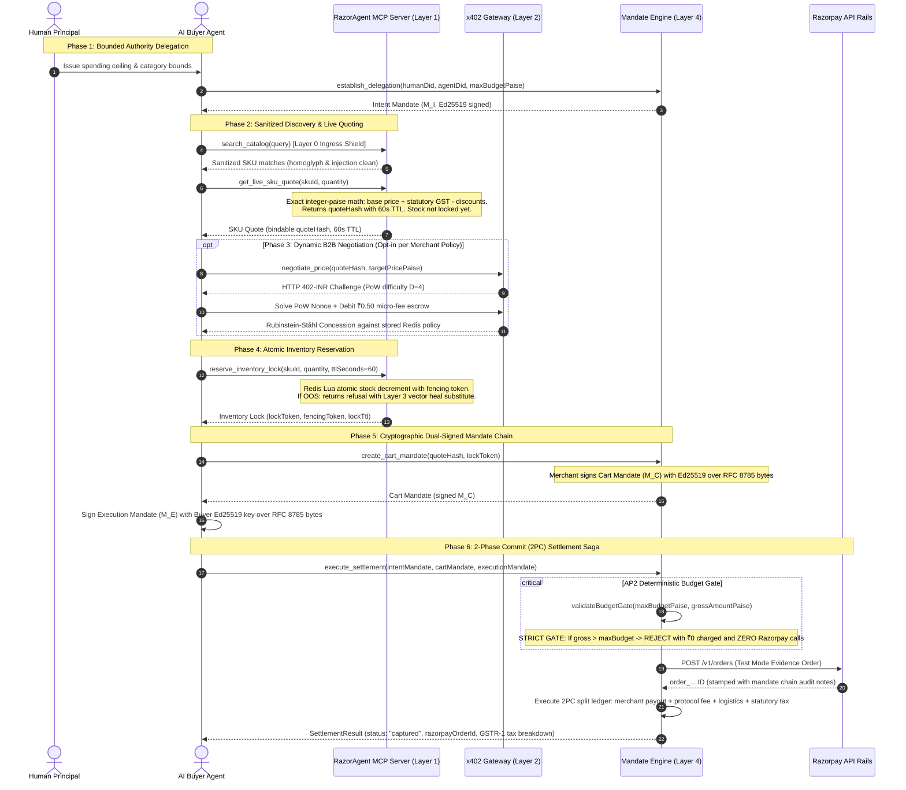

# RazorAgent Mesh: Autonomous Settlement Protocol for Agentic Commerce

---

## 1. Executive Overview

**RazorAgent Mesh** is the **"Stripe for the Autonomous Agentic Economy"** — an end-to-end, machine-to-machine (M2M) commerce and settlement protocol built natively on Razorpay rails.

As autonomous AI agents (enterprise procurement bots, ERP replenishment loops, and consumer AI assistants) replace human shoppers, existing HTML checkouts and manual 2FA become insurmountable friction points. RazorAgent Mesh provides a 6-layer autonomous commerce protocol with **bounded cryptographic safety**, **zero floating-point math drift**, and **100% Indian regulatory compliance** (RBI 2FA / NPCI UPI Circle Mode 2 / GST Rule 46).

### Track 01 Alignment & Razorpay's Evaluation Rubric ("The Bar")

RazorAgent Mesh is specifically engineered for **Razorpay AI Buildathon Track 01: AI Growth & Agentic Commerce** (*"Grow merchant revenue and make merchants sellable to AI buyers"*), strictly fulfilling every clause of Razorpay's Track 01 evaluation bar:

1. **Explainable:** Every rupee and paise is fully accounted for with inputs, decisions, amounts, and counterparties. The settlement enclave calculates exact line-level HSN tax (0%, 5%, 18%, 28%), Section 52 TCS (1%), and a 3-way Route split (Merchant, Logistics, Platform) with zero floating-point arithmetic drift and an immutable statutory GSTR-1 audit invoice.
2. **Bounded:** Hard limits protect buyer funds. The AP2 Budget Gate (`packages/mandateEngine/verification/budgetGate.py`) enforces per-transaction limits (`singleTransactionLimitPaise`) and cumulative spending caps (`maxBudgetPaise`). If a cart exceeds the authorized limit by even 1 paise, execution halts immediately with `BudgetExceededViolation`, ₹0 charged, and exactly **zero** Razorpay API calls (TC-03).
3. **Gated:** Autonomous agents never commit capital on bare LLM tokens. Every purchase requires a cryptographic dual-signed mandate chain ($M_I \to M_C \to M_E$) over RFC 8785 canonical JSON bytes with detached Ed25519 signatures, single-use anti-replay nonces in Redis `SETNX`, and NTP timestamp drift windows.
4. **Show the Audit Trail:** Complete audit trails are visible live on screen across Layer 5 panels (`/visualise` trace terminal, mandate explorer, GSTR-1 invoice preview on `/visualise/settle`) and persisted in Razorpay test-mode orders (`POST /v1/orders`) stamped with `cartMandateHash`, `executionId`, and merchant DID metadata.
5. **One Failure Handled Gracefully:**
   - *Out-of-Stock Failures:* Sub-300ms vector self-healing (`vectorHealer`) performs Qdrant cosine similarity search ($\ge 0.85$), enforces a strict 15% price ceiling, and verifies 5-dimensional AST constraints (allergens, brand, diet, SLA) before generating a dual-signed amendment mandate (TC-04, TC-22).
   - *Settlement Failures:* A failure during secondary Route split transfers triggers an automated Two-Phase Commit (2PC) saga compensation executing LIFO `reverseTransfer()` rollbacks, eliminating orphan allocations (TC-10, TC-13).
6. **End-to-End Autonomous Lifecycle:** Complete machine-to-machine flow from discovery across all 10 MCP tools to dynamic x402-INR negotiation, atomic inventory locking, and cryptographic settlement.
7. **Razorpay Test-Mode APIs:** Native integration with Razorpay test credentials (`RAZORPAY_KEY_ID`, `RAZORPAY_KEY_SECRET`, `RAZORPAY_ROUTE_LIVE`, `RAZORPAY_WEBHOOK_SECRET`) providing real Order IDs and webhook HMAC-SHA256 signature verification.

> Comprehensive technical deep dives, pitch scripts, and extended guides live in [`GUIDE.md`](./GUIDE.md).

---

## 2. Getting Started

### Prerequisites
- **Docker & Docker Compose** (recommended for full stack)
- **Python 3.13+** and **Node.js 22+** (for bare-metal execution and test suites)

### 1. Launch Full Stack with Docker Compose
From inside `razoragentMesh/`, copy the environment template and spin up the 7-container topology with a single command (all environment variables have safe development defaults pre-configured):

```bash
# Copy environment template (optional for mock ledger, pre-configured for Docker)
cp .env.example .env

# Spin up entire mesh
docker compose up --build
```

#### Exposed Service Ports & Endpoints
| Service | Port | Live Endpoint / Documentation |
|---|---|---|
| **Telemetry Dashboard & SKU Studio** | `3000` | [http://localhost:3000](http://localhost:3000) (Overview, Visualise, Merchant Studio, Docs) |
| **Mandate Settlement Engine API** | `8000` | [http://localhost:8000/docs](http://localhost:8000/docs) (Swagger UI) |
| **Merchant Onboarding & Bullion API** | `4002` | [http://localhost:4002/docs](http://localhost:4002/docs) (Swagger UI) |
| **x402 Dynamic Negotiation Gateway** | `4003` | [http://localhost:4003/docs](http://localhost:4003/docs) (Swagger UI) |
| **MCP Discovery Server** | `4001` | Streamable HTTP at `http://localhost:4001/mcp` · REST adapter at `http://localhost:4001/api/v1/*` |
| **Qdrant Vector DB Console** | `6333` | [http://localhost:6333/dashboard](http://localhost:6333/dashboard) |
| **Redis Nonce & Lock Ledger** | `6379` | `localhost:6379` |

A one-shot `catalog-seeder` service loads `tests/fixtures/catalogFixtures.json` into Redis and Qdrant at startup, so the stack never boots against an empty catalog.

### 2. Bare-Metal Local Execution
To run services individually outside Docker:

```bash
# 1. Start Redis & Qdrant locally (ports 6379, 6333)
# 2. Mandate Settlement Engine (port 8000)
python -m uvicorn packages.mandateEngine.mandateApp:app --port 8000 --reload

# 3. Merchant API & Bullion Oracle (port 4002)
python -m uvicorn packages.merchantApi.src.merchantApp:app --port 4002 --reload

# 4. x402 Negotiation Gateway (port 4003)
python -m uvicorn packages.x402Gateway.src.gatewayApp:app --port 4003 --reload

# 5. MCP Discovery Server (port 4001)
cd packages/mcpServer && npm run build && npm start

# 6. Telemetry Dashboard (port 3000)
cd packages/telemetryDashboard && npm run dev
```

### 3. Connect an External AI Agent
Connect any MCP-compatible agent (Claude Desktop, Claude Code, Cursor) in one command:

```bash
claude mcp add --transport http razoragent-mesh http://localhost:4001/mcp
```

Quick smoke-test quote against the running stack via the REST adapter:

```bash
curl "http://localhost:4001/api/v1/quote?skuId=SKU-LAPTOP-101&quantity=2&deliveryPincode=560001&buyerAgentDid=did:agent:demo.buyer.001"
```

To stop all Docker containers:
```bash
docker compose down
```

---

## 3. Testing

The load-bearing evidence is not the total test count, but the mathematical, cryptographic, temporal, and distributed invariants asserted across the test suites.

### 1. Invariant & Benchmark Evidence Suites
Run these three core invariant suites in about one minute:

```bash
# 1. 25 adversarial benchmark scenarios (TC-01 to TC-25) spanning all failure modes
python -m pytest tests/benchmarkHarness/ tests/testMultiItemGstrRounding.py tests/testConcurrentSettlementRace.py tests/testMerchantApiMalformedIngestion.py tests/testBullionAndSecurityInvariantsCore.py tests/testTemporalDeferredExecution.py tests/testBullionAndSecurityInvariantsAdversarial.py -v

# 2. 30 property-based invariants under Hypothesis (enclave math, GSTIN Luhn Mod-36, JCS/Ed25519, FSM)
python -m pytest tests/property/ -v

# 3. 12 golden GST vectors asserted across BOTH Python enclave and Node.js TypeScript engine
python -m pytest tests/testCrossSdkTsPyCompatibility.py -v
```

### 2. Full Monorepo Test Matrix
Execute the entire test matrix across all 4 monorepo subsystems:

```bash
# Python Backend & Python Buyer SDK
python -m pytest tests/ packages/buyerSdkPy/tests/ -q --tb=short

# MCP Discovery Server Tools
Push-Location packages/mcpServer; npm test; Pop-Location

# Standalone TypeScript Buyer SDK
Push-Location packages/buyerSdkTs; npm test; Pop-Location

# Google Stitch Telemetry Dashboard
Push-Location packages/telemetryDashboard; npm test; Pop-Location
```

<!-- testcounts:start -->
<!-- Generated by scripts/countTests.py -- do not edit by hand. -->

| Suite | Tests | Command that produced this number |
|---|---:|---|
| Python backend + Python Buyer SDK | 1388 | `python -m pytest tests/ packages/buyerSdkPy/tests/ --collect-only -q` |
| MCP discovery server | 313 | `cd packages/mcpServer && npm test` |
| TypeScript Buyer SDK | 98 | `cd packages/buyerSdkTs && npm test` |
| Telemetry dashboard + SKU Studio | 344 | `cd packages/telemetryDashboard && npm test` |
| **Total** | **2,143** | `python scripts/countTests.py` |

<!-- testcounts:end -->

### 3. Automated Quantitative Verification
Every claim in this repository is backed by an automated verification script:

| Command | Invariant Proved |
|---|---|
| `python scripts/countTests.py --check` | Confirms zero hand-typed test counts across docs (Rule V-01) |
| `npx tsx examples/typescript/mandateChain.ts` | Builds full AP2 mandate chain, verifies Ed25519 signatures, asserts cart tampering is rejected |
| `PYTHONPATH=packages/buyerSdkPy python examples/python/mandateChain.py` | Same AP2 mandate chain proof in Python |
| `npm.cmd --prefix packages/telemetryDashboard run docs:verify` | Confirms every route, parameter, and method in documentation resolves to code |
| `python scripts/verifyExamples.py` | Asserts all example code compiles and runs cleanly against the SDKs |

---

## 4. Architecture & Layer Diagram

### 6-Layer Protocol Stack

```
┌─────────────────────────────────────────────────────────────────────────────────────────────┐
│                               RAZORAGENT MESH PROTOCOL STACK                                │
├─────────────────────────┬───────────────────────────────────────────────────────────────────┤
│ Layer 0: Ingress Shield │ Untrusted Catalog Sanitization (Zero-Width/ANSI/Markdown Filter)   │
│ Layer 1: Discovery      │ Anthropic Model Context Protocol (MCP) JSON-RPC 2.0 Tools (10)   │
│ Layer 2: Negotiation    │ Fiat-Native HTTP 402-INR Micro-Metering + AST Contract State Mach │
│ Layer 3: Resilience     │ Sub-300ms Vector Similarity (Qdrant) + 5D AST Constraint Filter   │
│ Layer 4: Settlement     │ Google AP2 Mandates + NPCI UPI Circle + Razorpay Route Split Rails │
│ Layer 5: Observability  │ Real-Time SSE Stream + 8-Route Google Stitch React Dashboard      │
└─────────────────────────┴───────────────────────────────────────────────────────────────────┘
```

### The 10 Deterministic MCP Tools (Layer 1 & 4)

Merchants expose standard Model Context Protocol (MCP) JSON-RPC 2.0 endpoints (`packages/mcpServer`) over stdio and Streamable HTTP at `POST /mcp` (REST adapter mirrored at `/api/v1/*`):

| Tool Name | Layer | Protocol Function | Key Parameter Schemas |
|---|---|---|---|
| `establish_agent_delegation` | L4 | Issues signed `IntentMandate` ($M_I$) binding buyer agent to human spending ceiling | `key_custody` (`agent_held` \| `mesh_demo_custodial`), `max_budget_paise`, `single_transaction_limit_paise`, `authorized_categories` |
| `search_catalog` | L1 | Semantic catalog search via `all-MiniLM-L6-v2` 384-dim Qdrant vector embeddings | `query_text`, `limit` |
| `browse_catalog` | L1 | Faceted catalog filtering across category, brand, HSN, and upcoming promotions | `category`, `brand`, `hsn_code`, `has_upcoming_promotion`, `min_stock`, `limit` |
| `get_live_sku_quote` | L1 | Real-time pricing, 4-step discount waterfall, zonal shipping SLA, statutory GST | `sku_id`, `quantity`, `delivery_pincode`, `buyer_agent_id`, `promo_code` |
| `negotiate_price` | L2 | Rubinstein-Ståhl alternating-offer bargaining with x402-INR escrow & PoW | `sku_id`, `quantity`, `opening_bid_paise`, `max_unit_price_paise`, `buyer_agent_id` |
| `reserve_inventory_lock` | L1/4 | Atomic 60s Redis Lua stock reservation with monotonic fencing token & signature | `sku_id`, `quantity`, `quote_hash`, `buyer_agent_id`, `lock_ttl_seconds` |
| `verify_shipping_sla` | L1 | Zonal courier transit SLAs (Zone A/B/C) and weight-bracket fee resolution | `origin_pincode`, `delivery_pincode`, `package_weight_grams`, `required_delivery_tier` |
| `create_cart_mandate` | L4 | Re-derives tax, verifies lock, generates merchant-signed `CartMandate` ($M_C$) | `delegation_id`, `sku_id`, `quantity`, `quote_hash`, `lock_token`, `delivery_pincode` |
| `sign_execution_mandate` | L4 | Cryptographically hash-binds $M_I \to M_C \to M_E$ over RFC 8785 canonical bytes | `delegation_id`, `cart_mandate_hash` |
| `execute_settlement` | L4 | AP2 budget gate, 2PC saga split, Section 52 TCS, GSTR-1 tax invoice, Orders API | `delegation_id`, `execution_id`, `agent_signature`, `merchant_account` |

### End-to-End Autonomous Purchase Lifecycle



---

## 5. Integration with Existing Razorpay Infrastructure

Based on the technical assessment in `research/razorpayIntegrationReadiness.html` and `research/razorpayLandscapeVsRazorAgentMesh.html`, RazorAgent Mesh is architected with a clear boundary between what runs live today and what is designed for future infrastructure alignment:

### Live Today (Production Ready on Test-Mode Rails)

1. **Orders API (`POST /v1/orders`):**
   - Every completed settlement saga creates an authentic Razorpay order stamped with immutable cryptographic notes (`cartMandateHash`, `executionId`, `merchantDid`, `delegationId`).
   - Creates an indisputable statutory audit trail linking Razorpay's banking ledger to the cryptographic mandate chain.
2. **Webhook Ingestion & HMAC Verification (`POST /api/v1/webhooks/razorpay`):**
   - Native webhook receiver verifying incoming deliveries using constant-time `hmac.compare_digest` with `RAZORPAY_WEBHOOK_SECRET`.
   - Strictly enforces a 300-second freshness window to reject replayed deliveries and de-duplicates on `X-Razorpay-Event-Id`.
3. **Razorpay Route Split Rails (`POST /payments/{id}/capture`, `POST /transfers`, `POST /transfers/{id}/reversals`):**
   - `RazorpayRouteClient` (`packages/mandateEngine/settlement/razorpayRouteClient.py`) contains complete HTTP transports for live test mode alongside the deterministic mock ledger.
   - `buildRouteClient()` selects the transport dynamically based on `RAZORPAY_KEY_ID` and `RAZORPAY_KEY_SECRET`.
   - Executes 4-way split calculations: Merchant Net, Protocol Fee, Logistics Payout, and Statutory Section 52 TCS (1%) withholding.
   - Orchestrates Two-Phase Commit (2PC) saga compensation: if a secondary transfer fails, the coordinator executes Last-In First-Out (LIFO) `reverseTransfer()` calls, refunding secondary splits before transitioning to `VOID` (TC-10).

### Designed-For Roadmap (Architectural Alignment with Razorpay Products)

1. **Escrow+:**
   - Currently, `MicroEscrowClient` manages local micro-metering sessions and signs debit receipts during negotiation turns (`packages/x402Gateway/src/escrow/escrowSessionManager.py`).
   - Designed to integrate with Razorpay Escrow+ to hold real buyer funds during multi-turn negotiation and release them upon settlement commitment.
2. **UPI Reserve Pay (NPCI UPI Circle Mode 2):**
   - The AP2 delegation model (`IntentMandate` with `maxBudgetPaise` and `singleTransactionLimitPaise`) directly maps to NPCI UPI Circle Mode 2 (Delegated Payments).
   - Designed for UPI Reserve Pay to act as the autonomous buyer agent's delegated funding instrument without human OTP intervention.
3. **TokenHQ:**
   - For agent transactions requiring card rails, TokenHQ provides network tokenization, allowing buyer agents to hold tokenized card credentials without raw PAN exposure.
4. **Agent Studio & Agentic Payments MCP:**
   - Complementary positioning: Razorpay's Agent Studio provides merchant-side Claude Agent tools; RazorAgent Mesh provides the bilateral, buyer-side autonomous commerce and settlement clearinghouse.

---