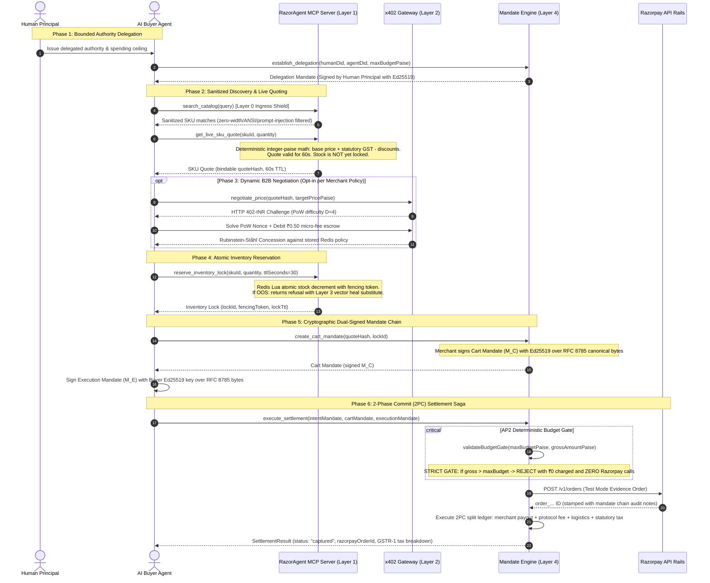

# 🚀 RazorAgent Mesh: Autonomous Settlement Protocol for Agentic Commerce

> **Track 01:** AI Growth & Agentic Commerce (Razorpay AI Buildathon 2026)  
> **Author:** Shubham Verma  
> **Target Program:** Razorpay AI Builder Internship (Bangalore HQ)  
> **Status:** Production Architecture (Version 2.0 Hardened)

---

## 1. Executive Overview

**RazorAgent Mesh** is the **"Stripe for the Autonomous Agentic Economy"** — an end-to-end, machine-to-machine (M2M) commerce and settlement protocol built natively on Razorpay rails.

As autonomous AI agents (enterprise procurement bots, ERP replenishment loops, and consumer AI assistants) replace human shoppers, existing HTML checkouts and manual 2FA become insurmountable friction points. RazorAgent Mesh provides a 6-layer autonomous commerce protocol with **bounded cryptographic safety**, **zero floating-point math drift**, and **100% Indian regulatory compliance** (RBI 2FA / NPCI UPI Circle / GST Rule 46).

```
┌─────────────────────────────────────────────────────────────────────────────────────────────┐
│                               RAZORAGENT MESH PROTOCOL STACK                                │
├─────────────────────────┬───────────────────────────────────────────────────────────────────┤
│ Layer 0: Ingress Shield │ Untrusted Catalog Sanitization (Zero-Width/ANSI/Markdown Filter)   │
│ Layer 1: Discovery      │ Anthropic Model Context Protocol (MCP) JSON-RPC 2.0 Tools         │
│ Layer 2: Negotiation    │ Fiat-Native HTTP 402-INR Micro-Metering + AST Contract State Mach │
│ Layer 3: Resilience     │ Sub-300ms Vector Similarity (Qdrant) + Negative Constraint Filter │
│ Layer 4: Settlement     │ Google AP2 Mandates + NPCI UPI Circle + Razorpay Route Split Rails │
│ Layer 5: Telemetry      │ Real-Time SSE Stream + 13-Route React/Next.js Live Dashboard      │
└─────────────────────────┴───────────────────────────────────────────────────────────────────┘
```

### End-to-End Autonomous Purchase Lifecycle



---

## 2. Adversarial Benchmark Matrix (TC-01 → TC-25)

The 10 core protocol scenarios below live under `tests/benchmarkHarness/`. Seven exercise real production code; three (TC-05, TC-06, TC-09) reimplement their subject and are listed under Known limitations rather than counted as evidence. Protocol hardening extended the matrix to **TC-25** (ingestion & normalization, bullion & dynamic pricing, Smart Wait & temporal alerts) — see [`GUIDE.md`](./GUIDE.md) for the full mapping:

| Test ID | Scenario Name | Invariants Verified | Assertions & Expected Outcome |
| :--- | :--- | :--- | :--- |
| **TC-01** | Nominal A2A Settlement Handshake | Full happy path: Discovery $\to$ 60s lock $\to$ AP2 Ed25519 signing $\to$ ₹4,200 single-turn settlement. | • `status == "captured"`<br>• `amountPaise == 420000`<br>• `stock == initial - 1` |
| **TC-02** | B2B Multi-Turn Dynamic Negotiation | 3-turn Rubinstein-Ståhl bargaining with monotonic concessions and ₹0.50/turn micro-escrow debit. | • `turns == 3`<br>• `unitPrice == 335000`<br>• `gross == 19765000`<br>• `microFees == 150` |
| **TC-03** | Budget Breach Defense (The Bar) | Cart ₹12,000 vs delegated budget ₹10,000. AP2 Budget Gate intercepts before gateway. | • `BudgetExceededViolation`<br>• `Razorpay API calls: 0`<br>• `₹0 charged` |
| **TC-04** | OOS Vector Self-Healing | SKU-101 OOS auto-substitutes SKU-104 (+₹50) via Qdrant Cosine similarity $\ge 0.85$ in $<300\text{ms}$. | • `healingLatencyMs < 300`<br>• `substitute == "SKU-104"`<br>• `dualSignature == VALID` |
| **TC-05** | Negative Constraint Filtering | Peanut allergen blacklist rejects candidate SKU-201 and selects SKU-205. | • `constraintViolations == 0`<br>• `selected == "SKU-205"` |
| **TC-06** | Anti-Spam Sybil PoW Defense | 100 concurrent spam bids: 1st receives HTTP 402 challenge with PoW; 99 rejected with 402. | • `rejectedSpamCount == 99`<br>• `serverLoad == 0%` |
| **TC-07** | Nonce Replay & Signature Tampering | Replaying consumed nonce after 30s raises `NonceReplayException` (409); payload tampering caught by Ed25519. | • `NonceReplayException`<br>• `SignatureVerificationException` |
| **TC-08** | Float Math Drift Interception | Injected float (e.g. `1976.501`) raises `ArithmeticDriftException`; 100% integer-paise conservation. | • `ArithmeticDriftException`<br>• `mathHallucinations == 0.000%` |
| **TC-09** | Concurrency Double-Spend Lock Race | 2 parallel agents lock last 1 unit simultaneously via Redis Lua. Exactly 1 succeeds, 1 gets 409. | • Agent A: `200 OK`<br>• Agent B: `409 Conflict`<br>• `stock == 0` |
| **TC-10** | Route Split Rollback (2PC) | Secondary split failure triggers 2PC saga compensation via `reverseTransfer()`. | • `reverseTransfer()` executed<br>• `state == VOID`<br>• All splits refunded |

---

## 3. Quickstart & Installation

### Prerequisites
- Docker & Docker Compose
- (Optional for running tests locally: Python 3.13+ and Node.js 22+)

### 1. Launch Full Stack with Docker Compose
From inside `razoragentMesh/`, launch the entire container topology:

```bash
docker compose up --build
```

Services exposed:
- **Telemetry Dashboard & SKU Studio:** [http://localhost:3000](http://localhost:3000)
- **Mandate Settlement Engine API Docs:** [http://localhost:8000/docs](http://localhost:8000/docs)
- **Merchant Onboarding & Bullion API Docs:** [http://localhost:4002/docs](http://localhost:4002/docs)
- **x402 Dynamic Negotiation Gateway Docs:** [http://localhost:4003/docs](http://localhost:4003/docs)
- **MCP Server:** three faces on port 4001. **Streamable HTTP at
  [http://localhost:4001/mcp](http://localhost:4001/mcp)** is how an external agent connects --
  Claude Desktop, Claude Code or Cursor points at that URL and gets all ten tools. MCP JSON-RPC
  2.0 over **stdio** serves runtimes that spawn a process instead. A **REST adapter** (`/health`,
  `/api/v1/tools`, `/api/v1/quote`, `/api/v1/lock`, `/api/v1/sla`) serves the buyer SDKs, whose
  calls are plain HTTP.

  Connecting your own agent takes one command:

  ```bash
  claude mcp add --transport http razoragent-mesh http://localhost:4001/mcp
  ```

  See **[the Agent Quickstart](./packages/telemetryDashboard/docs/agent-quickstart.mdx)** for the
  full walkthrough: publish a product from the dashboard, ask your agent to buy it in plain
  language, and watch the protocol execute live. To smoke-test the stdio transport directly:

  ```bash
  echo '{"jsonrpc":"2.0","id":1,"method":"tools/list","params":{}}' | docker run -i --rm -e MCP_TRANSPORT=stdio razoragent_mcp_server:latest node dist/mcpServerMain.js
  ```
- **Qdrant Vector DB Console:** [http://localhost:6333/dashboard](http://localhost:6333/dashboard)
- **Redis Nonce Ledger:** `localhost:6379`

Nothing else is required. A one-shot `catalog-seeder` service loads
`tests/fixtures/catalogFixtures.json` into Redis and Qdrant once both report healthy, and
`merchant-api` waits for it to exit 0 — so the stack never comes up against an empty catalog.
Every service declares a healthcheck, and the dashboard starts only once all four report healthy.

**Catalog contents.** Two sets of SKUs are live, and both are quotable through the same path:

| Source | Example ids | Where they come from |
|---|---|---|
| Compiled fixtures | `SKU-LAPTOP-101`, `SKU-CHAIR-001`, `SKU-OIL-201` | `packages/mcpServer/src/catalog/catalogFixtures.ts`, baked into the image |
| Seeded catalog | `SKU-001`, `SKU-101`, `SKU-201` | `tests/fixtures/catalogFixtures.json`, loaded by `catalog-seeder` |

The MCP server reads `mesh:catalog:*` out of Redis at startup and merges it over the compiled
fixtures, then follows the `mesh:catalog:updates` channel for later changes. So a SKU published
through the Merchant Studio survives a restart, and a seeded SKU is quotable immediately.

A live quote, against the running stack:

```bash
curl "http://localhost:4001/api/v1/quote?skuId=SKU-LAPTOP-101&quantity=2&deliveryPincode=560001&buyerAgentDid=did:agent:demo.buyer.001"
```

`buyerAgentDid` must match `^did:agent:[a-z0-9_.:-]+$`; the quote tool returns HTTP 422 otherwise.

To stop all services:
```bash
docker compose down
```

To stop them and discard the seeded catalog as well:
```bash
docker compose down -v
```

### 2. Run Test Suites & Invariant Benchmarks

The load-bearing evidence is not the size of the suite. It is these three things, which
run in about a minute:

```bash
# 10 adversarial benchmark scenarios TC-01..TC-10, one per failure mode (19 tests)
python -m pytest tests/benchmarkHarness/ -v

# 30 property-based invariants under Hypothesis (enclave math, GSTIN Luhn, JCS/Ed25519, negotiation FSM)
python -m pytest tests/property/ -v

# 12 golden GST vectors asserted against BOTH the Python enclave and the TypeScript
# pricing engine in one test -- the TS half runs in a real node subprocess
python -m pytest tests/testCrossSdkTsPyCompatibility.py -v
```

Then the full matrix:

```bash
python -m pytest tests/ packages/buyerSdkPy/tests/ -q --tb=short
Push-Location packages/mcpServer; npm test; Pop-Location
Push-Location packages/buyerSdkTs; npm test; Pop-Location
Push-Location packages/telemetryDashboard; npm test; Pop-Location
```

<!-- testcounts:start -->
<!-- Generated by scripts/countTests.py -- do not edit by hand. -->

| Suite | Tests | Command that produced this number |
|---|---:|---|
| Python backend + Python Buyer SDK | 1388 | `python -m pytest tests/ packages/buyerSdkPy/tests/ --collect-only -q` |
| MCP discovery server | 313 | `cd packages/mcpServer && npm test` |
| TypeScript Buyer SDK | 98 | `cd packages/buyerSdkTs && npm test` |
| Telemetry dashboard + SKU Studio | 344 | `cd packages/telemetryDashboard && npm test` |
| **Total** | **2,143** | `python scripts/countTests.py` |

<!-- testcounts:end -->

### Verifying the claims in this README

Every number here is produced by a command, and each command is runnable from a clean
checkout. Nothing in this section takes more than a minute.

| Command | What it proves |
|---|---|
| `python scripts/countTests.py --check` | No test count in this README or the guide was hand-typed |
| `npx tsx examples/typescript/mandateChain.ts` | Builds a full AP2 mandate chain, verifies it, edits the cart, and exits non-zero unless the first verifies **and** the tampered second is refused |
| `PYTHONPATH=packages/buyerSdkPy python examples/python/mandateChain.py` | The same proof, in Python |
| `cd packages/telemetryDashboard && npm run docs:verify` | Every method, argument, port and route the guides name still exists in the code |
| `python scripts/generateApiReference.py` | Regenerates the API tables; a non-empty `git diff` afterwards means the committed reference is stale |
| `python scripts/mutationScore.py` | Measures how much of the suite's protection is real — see [`docs/TEST_QUALITY_AUDIT.md`](docs/TEST_QUALITY_AUDIT.md) |

Treat the test total as inventory, not as evidence: a statutory GST bug in this repository
survived 1,545 of these tests, because no test compared the two implementations against each
other. The benchmarks, property invariants, and cross-language vectors above are what
actually constrain behaviour.

---

## 3.1 Documentation Index

Technical documentation lives in [`packages/telemetryDashboard/docs/`](./packages/telemetryDashboard/docs/)
and is rendered live by the dashboard at `/docs/*`. It is co-located with the service that serves it,
so the Docker build context stays self-contained.

| Document | Live route | Scope |
|---|---|---|
| [`setup.mdx`](./packages/telemetryDashboard/docs/setup.mdx) | `/docs/setup` | Environment, container topology, and local setup |
| [`agent-quickstart.mdx`](./packages/telemetryDashboard/docs/agent-quickstart.mdx) | `/docs/agent-quickstart` | Connecting your own agent over MCP and driving a signed purchase end to end |
| [`onboarding.mdx`](./packages/telemetryDashboard/docs/onboarding.mdx) | `/docs/onboarding` | Full protocol topology, merchant onboarding, and buyer-agent lifecycle in TS and Python |
| [`buyer-sdk.mdx`](./packages/telemetryDashboard/docs/buyer-sdk.mdx) | `/docs/buyer-sdk` | AI buyer agent SDK and AP2 protocol |
| [`merchant-guide.mdx`](./packages/telemetryDashboard/docs/merchant-guide.mdx) | `/docs/merchant-guide` | Merchant onboarding and the universal SKU Studio |
| [`telemetry.mdx`](./packages/telemetryDashboard/docs/telemetry.mdx) | `/docs/telemetry` | SSE streaming architecture, KPIs, the 12 canonical event schemas, and how a merchant builds an order feed on the same bus |
| [`gstr1-invoice.mdx`](./packages/telemetryDashboard/docs/gstr1-invoice.mdx) | `/docs/gstr1-invoice` | Statutory GST compliance, integer-paise arithmetic, JCS audit digest |

Repository-level documentation not served by the dashboard:

| Document | Scope |
|---|---|
| [`docs/STATUTORY_RATES.md`](./docs/STATUTORY_RATES.md) | Where tax rates live, their citations and verification dates, and the procedure for keeping them true |
| [`docs/AGENT_SETUP_TROUBLESHOOTING.md`](./docs/AGENT_SETUP_TROUBLESHOOTING.md) | Symptom-by-symptom fixes for connecting an external agent, with the exact error text |
| [`GUIDE.md`](./GUIDE.md) | Architecture and presentation material |
| [`PROJECT.md`](./PROJECT.md) | Completed milestone log |
| [`AUDIT_TODO.md`](./AUDIT_TODO.md) | The audit findings still open, the standing debt, and the rule for adding a finding |
| [`AUDIT_ARCHIVE.md`](./AUDIT_ARCHIVE.md) | The 51 closed findings with the evidence that proved each and the note recording what closed it |

---

## 4. 5-Minute Interactive Demo Walkthrough

1. **Discovery:** Open Telemetry Dashboard at `http://localhost:3000`. Observe live MCP tool calls (`get_live_sku_quote`) discovering merchant pricing tiers.
2. **Dynamic B2B Negotiation:** Watch the live dual-curve convergence chart as Buyer Agent and Merchant negotiate bulk pricing over 3 turns with ₹0.50 micro-escrow debits.
3. **Cryptographic Mandate Signing:** Inspect the AP2 mandate explorer displaying real-time Ed25519 signature badges for $M_I$, $M_C$, and $M_E$.
4. **OOS Self-Healing:** Trigger an out-of-stock event on SKU-101 and watch the Vector Diff Viewer substitute SKU-104 in $< 300\text{ms}$.
5. **Razorpay Route 2PC Settlement:** Watch the live webhook feed capture payment and execute 3-way split transfers to Merchant, Protocol, and Logistics accounts.

---

## 5. Scope & Limitations

This is a protocol prototype built for the Razorpay AI Buildathon, not a production payments
system. The boundaries below are deliberate engineering choices made to keep the protocol layer
the focus, and they are stated here so they read as decisions rather than oversights.

### Deliberately out of scope

**No authentication or authorization on the HTTP surface.** Merchant routes
(`POST/PUT/DELETE` on catalog, policy, bulk-ingest, registration) are open, and merchant
identity is a path parameter. Anyone who can reach the API can mutate any merchant's catalog.
Production would need API keys or mTLS plus per-merchant authorization; the *agent-facing*
settlement path is separately protected by Ed25519 mandate verification and AP2 delegation
binding, which is where the protocol's security claims actually live.

**No rate limiting or anti-abuse on the merchant API.** The x402 gateway does implement
proof-of-work and micro-escrow for agent negotiation, but the merchant surface has neither.

**Single-tenant assumptions.** There is no tenant isolation in Redis keyspaces or Qdrant
collections beyond naming conventions.

**Razorpay integration runs in mock mode by default.** `RazorpayRouteClient(isMockMode=True)`
simulates capture, transfer and reversal. The live HTTP path exists and is exercised by tests,
but the demo does not move real money.

### Known limitations of what *is* implemented

**TCS rates are not effective-dated.** Section 52 rates are a single set of constants reflecting
the rate currently in force (0.5% per Notification 15/2024-Central Tax). Reissuing an invoice
for a supply made before 10 July 2024 would apply today's rate rather than the rate in force on
the supply date. See [docs/STATUTORY_RATES.md](docs/STATUTORY_RATES.md).

**The cumulative budget cap fails open.** If Redis is unavailable, `SettlementLedger` logs a
warning and allows the settlement rather than blocking it — a deliberate choice so that a
degraded cache cannot halt a live demo. Production should fail closed.

**Test coverage is mock-backed.** The suite runs against `fakeredis` and in-process doubles for
Qdrant and Razorpay. It verifies protocol logic thoroughly; it does not verify real
infrastructure behaviour under failure.

**Settlement has only ever run in mock mode here, but an environment variable does change
that.** `buildRouteClient` (`packages/mandateEngine/settlement/routeClientFactory.py`) selects the
live transport whenever `MandateEngineSettings.hasRazorpayCredentials` holds -- that is, when
`RAZORPAY_KEY_ID` is not one of the `placeholderRazorpayKeyIds` (`""`, `rzp_test_mock`,
`rzp_test_MockApiKey12345`) and `RAZORPAY_KEY_SECRET` is non-empty. Both are read at
`packages/mandateEngine/config.py:25,30`. Ship the defaults and you get `isMockMode=True` and a
logged warning; supply real credentials and settlement will reach the Razorpay Route API. Every
settlement *this repository* has executed went through the mock ledger, because the placeholder
values were never replaced. The 2PC saga, compensation and invoicing around it are real.

**Three benchmark files assert their own reimplementations.**
`testTc05NegativeConstraint.py`, `testTc06AntiSpamSybil.py` and `testTc09ConcurrencyDoubleLock.py`
import no production module at all -- they define the subsystem under test and then exercise that
definition, so they would pass unchanged if `packages/` were deleted. `tests/unit/testBenchmarkHarnessIntegrity.py`
freezes the count at three so a fourth cannot appear. The other benchmarks do import real code.

**The idempotency header name is provider-specific and unverified.**
`headerIdempotencyKey` in `razorpayRouteClient.py` must be confirmed against the current
Razorpay API reference before live use. The mechanism is correct regardless of the header
string.

**An order cannot be looked up after the fact.** `SettlementResult` -- carrying the `paymentId`,
the `transfers[]` and the full GSTR-1 invoice -- is built at `settlementOrchestrator.py:192` and
returned to the caller. It is never persisted: the only settlement keys in Redis are existence
flags for replay defence. If the caller loses the response, the receipt is unrecoverable. There
is no `get_order_status` tool and no invoice re-fetch endpoint.

**Nothing tells a merchant that a sale happened.** There is no order email, SMS or merchant
callback. A merchant integrates by subscribing to the same SSE bus the dashboard reads --
`GET /api/v1/telemetry/stream` -- which is documented under *Merchant-side subscribers* in
[docs/telemetry.mdx](packages/telemetryDashboard/docs/telemetry.mdx), including the two joins that
are not where a reader expects: no event carries `merchantDid` (filter `PAYMENT_CAPTURED` on
`transfers[].recipientAccountId`), and `sessionId` does not join across the settlement boundary
because the engine puts the payment id in that field. The reverse direction is missing too:
`POST /api/v1/webhooks/razorpay` now receives deliveries -- it verifies the HMAC-SHA256 signature,
rejects anything outside the 300-second freshness window, and de-duplicates on
`X-Razorpay-Event-Id`; set `RAZORPAY_WEBHOOK_SECRET` to enable it, and unset it answers 503 rather
than accepting what it cannot verify. But it reconciles nothing, and says so in its own response
(`"reconciled": false`): with no persisted order, a `payment.failed` or `refund.created` delivery
has nothing to amend. The one outbound notification path that exists serves buyers, not merchants:
signed price-drop alerts to a subscriber's callback URL (`POST /api/v1/alerts/price-drop`).

**There is no cancel or refund path.** `AmendmentMandate` has a schema
(`mandateEngine/mandates/amendmentMandateSchema.py`), a factory, and builders in both SDKs -- but
no verifier and no route consumes one. The Route client exposes `capturePayment`,
`createTransfer` and `reverseTransfer` and no `refundPayment`, and `compensateTransfers` reverses
the *split transfers*, not the primary capture. Reversing a settled purchase would also need the
transfer IDs, which live only in the unpersisted result above. This is the largest absent feature
and it is blocked on order persistence.

**A delegation cannot be scoped to a merchant.** It bounds budget, categories and validity;
there is no `authorized_merchants` field. The pattern to add would mirror
`_verifyCategoryAuthorization` and check `cartMandate.merchantDid`, which the merchant signs --
the same value the Route payout account is resolved from
(`mcpServer/src/merchant/merchantPayoutRegistry.ts`), so that identity is already what decides
where money goes. With one hardcoded demo merchant key the check would be structurally correct
but not yet discriminating, which is why it was not added.

**Out-of-stock substitution is HTTP-only.** `POST /api/v1/catalog/heal-oos` works and publishes
`OOS_HEALED`, but no MCP tool reaches it, so an agent that hits an out-of-stock SKU over MCP is
told no and has to search again itself.

**An offer is authored one SKU at a time; there are no product tags.** A merchant who wants the
same campaign on ten listings fills the Studio's Offers panel ten times. Tagging products and
scoping one offer to a tag was evaluated on 2026-09-03 and deliberately deferred, for three
reasons worth stating rather than leaving as a gap.

The first is that the fan-out does not exist here. Across both SKU sets -- 25 seeded plus 22
compiled -- the largest category holds **four** listings (`Pantry & Groceries`, `IT Hardware`),
and most hold one to three. Reproduce with
`grep -o '"category": *"[^"]*"' tests/fixtures/catalogFixtures.json | sort | uniq -c | sort -rn`.
A tag-scoped offer would spare a merchant at most three repetitions of a form they fill once per
listing, and cost a schema change through the Pydantic model, the broadcast payload, the
TypeScript type and its Zod preprocess, both fixture sets, the seeder and the Studio.

The second is that it collides with the rule that makes merchant-authored offers honest.
`resolveSkuOffers` (`mcpServer/src/catalog/pricingEngine.ts`) treats the presence of
`merchantOffers` as a *complete* statement of a SKU's offers, which is the only reason a merchant
can switch the mesh's built-in festive discount off. A tag-scoped offer layered on top has no good
answer for a SKU that declares `merchantOffers` and also carries a promoted tag: let the tag win
and the merchant can no longer opt out per SKU; let the SKU win and tags do nothing on any listing
the merchant has touched; merge them and the built-in defaults become unremovable again.

The third is that `category` stopped being decorative. `_verifyCategoryAuthorization`
(`mandateEngine/verification/budgetGate.py`) enforces it against the delegation's
`authorized_categories`, fed from the merchant-signed cart, and its docstring commits to "one
category vocabulary, one notion of equality". A second merchant-authored label set beside it would
have to be explicitly non-authorizing, which is a claim to defend rather than a field to add.

What the idea was actually reaching for -- an agent finding what is about to get cheaper without
quoting the whole catalog -- shipped instead as `next_promotion` and `has_upcoming_promotion` on
`browse_catalog`, using the quote's own evaluator so the two surfaces cannot disagree. Tags remain
the right answer at a few hundred SKUs, alongside a deliberate decision on offer precedence.

**A negotiated price is recorded, not applied.** `negotiate_price` runs the real protocol and the
gateway compiles an immutable contract AST on convergence, but nothing feeds that price back into
`get_live_sku_quote` -- which remains the only source of a bindable `quote_hash`. An agent that
negotiates and then quotes is quoted the list price. Wiring the two together needs an answer to
who may claim a negotiated price, which is a design question, not a missing line.

**Negotiation state is process-local.** `negotiateRoute.activeNegotiators` is a plain dict keyed
`{buyerAgentDid}:{skuId}`, not Redis. It does not survive a gateway restart and would not work
across replicas. Fine for a single-container demo; the tool's description says so rather than
implying durability.

**A determined buyer converges at the merchant's floor, not at a midpoint.** The gateway clamps
the seller's ask into `[floor, listPrice]` from the merchant's own policy, so a buyer cannot name
its own price -- but a buyer that proposes an absurd ask and bids at or above the floor converges
there on turn one rather than being walked down a concession ladder. The merchant never sells
below the price they declared acceptable, which is what a floor means; what is missing is the
merchant conceding *gradually* from list toward it. `computeSellerCounterAsk`
(`negotiation/marginEvaluator.py`) exists for that and the route does not call it, because its
ladder is a flat ₹5 per turn -- 0.25% of a four-figure item over a whole negotiation, which never
meets any realistic bid. A proportional ladder is the fix and is a behaviour change to every
negotiation, so it is named here rather than rushed in.

**There is no merchant-side agent; the merchant is represented by their policy.** Nothing
autonomously argues the seller's case. `resolveMerchantNegotiationTerms` reads the two records
only a merchant can write -- the SKU listing and `mesh:merchant:policy:{did}` -- and the gateway
holds the ask inside that band. Negotiation is opt-in and off by default, so a merchant who has
configured nothing answers HTTP 403 and `negotiate_price` reports `DECLINED`.

> This replaced a real hole rather than a cosmetic one. Until 2026-09-03 the route took
> `sellerAskPaise` and `merchantDid` straight from the buyer's request body and checked only
> intra-session monotonicity, which is vacuous on turn one. Measured against the running stack: a
> buyer declared the seller's ask at 1 paise on a SKU listed at 420000 paise, converged
> immediately, and received a compiled, hashed contract AST naming the merchant at that price.

**Six states resolve to the wrong tax code at two-digit pincode granularity.** `pincodePrefixStateMap`
keys on the first two digits, which cannot separate Goa (403xxx, resolved as Maharashtra --
GST state 27 rather than 30), Puducherry (605xxx), Sikkim (737xxx), Andaman & Nicobar (744xxx),
Ladakh (194xxx), or the individual north-eastern states inside the 79x block. Correcting this
needs three-digit granularity in both the TypeScript and Python maps, and there is no shared
fixture keeping the two in step -- the nearest precedent is `tests/fixtures/gstGoldenVectors.json`.
An unmapped prefix is now refused rather than silently taxed as Karnataka; these six are mapped,
just mapped coarsely.

**The Python buyer SDK cannot negotiate.** It has `getPowChallenge`, `createEscrowSession` and
`releaseEscrow`, and imports `endpointMeshNegotiate` for URL routing, but there is no
`negotiateTurn` method -- so the negotiation loop exists only in the MCP server's
`negotiate_price`. The TypeScript SDK is in the same position.

### Where the engineering effort actually went

Integer-paise arithmetic with no floating point in any monetary path; RFC 8785 JCS
canonicalization verified byte-identical across the Python and TypeScript SDKs; statutory GST
computed so CGST and SGST are equal by construction; AP2 mandate chain verification with
delegation binding, cumulative budget enforcement and cart replay defence; and a 2PC settlement
saga with durable Redis-backed compensation.
